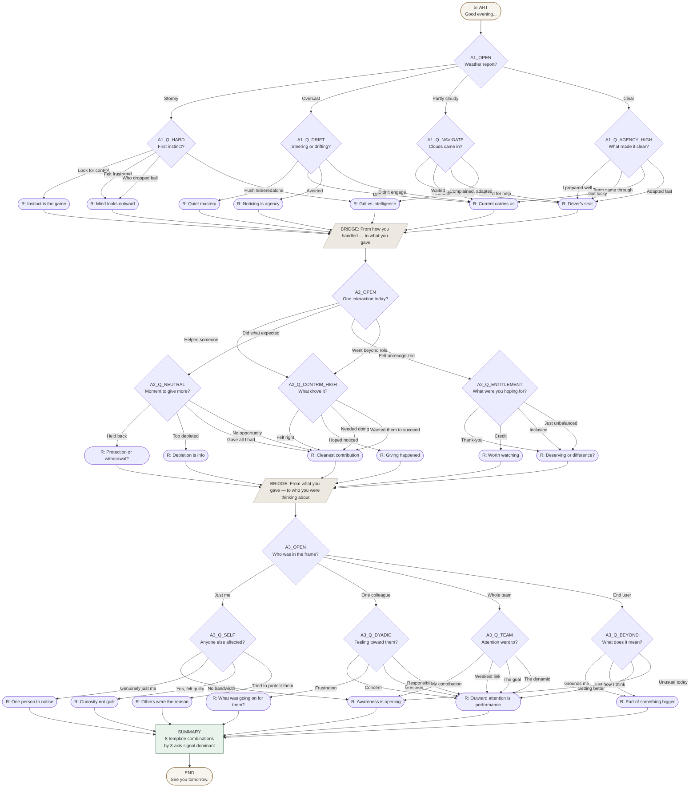

```mermaid
flowchart TD
    START([START\nGood evening...]) --> A1_OPEN

    A1_OPEN{A1_OPEN\nWeather report?}
    A1_OPEN -->|Stormy| A1_Q_HARD
    A1_OPEN -->|Overcast| A1_Q_DRIFT
    A1_OPEN -->|Partly cloudy| A1_Q_NAVIGATE
    A1_OPEN -->|Clear| A1_Q_AGENCY_HIGH

    A1_Q_HARD{A1_Q_HARD\nFirst instinct?}
    A1_Q_HARD -->|Look for control| A1_R_PIVOT
    A1_Q_HARD -->|Felt frustrated| A1_R_EXT_STRONG
    A1_Q_HARD -->|Who dropped ball| A1_R_EXT_STRONG
    A1_Q_HARD -->|Push through alone| A1_R_STOIC

    A1_Q_DRIFT{A1_Q_DRIFT\nSteering or drifting?}
    A1_Q_DRIFT -->|Steered| A1_R_SUBTLE_AGENCY
    A1_Q_DRIFT -->|Drifted| A1_R_EXT_GENTLE
    A1_Q_DRIFT -->|Avoided| A1_R_AVOIDANCE
    A1_Q_DRIFT -->|Didn't engage| A1_R_EXT_GENTLE

    A1_Q_NAVIGATE{A1_Q_NAVIGATE\nClouds came in?}
    A1_Q_NAVIGATE -->|Found different route| A1_R_INT_STRONG
    A1_Q_NAVIGATE -->|Waited| A1_R_EXT_GENTLE
    A1_Q_NAVIGATE -->|Asked for help| A1_R_INT_STRONG
    A1_Q_NAVIGATE -->|Complained, adapted| A1_R_STOIC

    A1_Q_AGENCY_HIGH{A1_Q_AGENCY_HIGH\nWhat made it clear?}
    A1_Q_AGENCY_HIGH -->|I prepared well| A1_R_INT_STRONG
    A1_Q_AGENCY_HIGH -->|Team came through| A1_R_INT_STRONG
    A1_Q_AGENCY_HIGH -->|Got lucky| A1_R_EXT_GENTLE
    A1_Q_AGENCY_HIGH -->|Adapted fast| A1_R_INT_STRONG

    A1_R_INT_STRONG([R: Driver's seat]) --> BRIDGE_1_2
    A1_R_EXT_STRONG([R: Mind looks outward]) --> BRIDGE_1_2
    A1_R_EXT_GENTLE([R: Current carries us]) --> BRIDGE_1_2
    A1_R_PIVOT([R: Instinct is the game]) --> BRIDGE_1_2
    A1_R_STOIC([R: Grit vs intelligence]) --> BRIDGE_1_2
    A1_R_SUBTLE_AGENCY([R: Quiet mastery]) --> BRIDGE_1_2
    A1_R_AVOIDANCE([R: Noticing is agency]) --> BRIDGE_1_2

    BRIDGE_1_2[/BRIDGE: From how you handled — to what you gave/] --> A2_OPEN

    A2_OPEN{A2_OPEN\nOne interaction today?}
    A2_OPEN -->|Helped someone| A2_Q_CONTRIB_HIGH
    A2_OPEN -->|Did what expected| A2_Q_NEUTRAL
    A2_OPEN -->|Felt unrecognized| A2_Q_ENTITLEMENT
    A2_OPEN -->|Went beyond role| A2_Q_CONTRIB_HIGH

    A2_Q_CONTRIB_HIGH{A2_Q_CONTRIB_HIGH\nWhat drove it?}
    A2_Q_CONTRIB_HIGH -->|Felt right| A2_R_CONTRIB_PURE
    A2_Q_CONTRIB_HIGH -->|Hoped noticed| A2_R_CONTRIB_MIXED
    A2_Q_CONTRIB_HIGH -->|Needed doing| A2_R_CONTRIB_PURE
    A2_Q_CONTRIB_HIGH -->|Wanted them to succeed| A2_R_CONTRIB_PURE

    A2_Q_NEUTRAL{A2_Q_NEUTRAL\nMoment to give more?}
    A2_Q_NEUTRAL -->|Held back| A2_R_CONSERVATION
    A2_Q_NEUTRAL -->|Too depleted| A2_R_DEPLETION
    A2_Q_NEUTRAL -->|Gave all I had| A2_R_CONTRIB_PURE
    A2_Q_NEUTRAL -->|No opportunity| A2_R_CONTRIB_PURE

    A2_Q_ENTITLEMENT{A2_Q_ENTITLEMENT\nWhat were you hoping for?}
    A2_Q_ENTITLEMENT -->|Thank-you| A2_R_ENT_GENTLE
    A2_Q_ENTITLEMENT -->|Credit| A2_R_ENT_MODERATE
    A2_Q_ENTITLEMENT -->|Inclusion| A2_R_ENT_GENTLE
    A2_Q_ENTITLEMENT -->|Just unbalanced| A2_R_ENT_GENTLE

    A2_R_CONTRIB_PURE([R: Cleanest contribution]) --> BRIDGE_2_3
    A2_R_CONTRIB_MIXED([R: Giving happened]) --> BRIDGE_2_3
    A2_R_ENT_GENTLE([R: Deserving or difference?]) --> BRIDGE_2_3
    A2_R_ENT_MODERATE([R: Worth watching]) --> BRIDGE_2_3
    A2_R_CONSERVATION([R: Protection or withdrawal?]) --> BRIDGE_2_3
    A2_R_DEPLETION([R: Depletion is info]) --> BRIDGE_2_3

    BRIDGE_2_3[/BRIDGE: From what you gave — to who you were thinking about/] --> A3_OPEN

    A3_OPEN{A3_OPEN\nWho was in the frame?}
    A3_OPEN -->|Just me| A3_Q_SELF
    A3_OPEN -->|One colleague| A3_Q_DYADIC
    A3_OPEN -->|Whole team| A3_Q_TEAM
    A3_OPEN -->|End user| A3_Q_BEYOND

    A3_Q_SELF{A3_Q_SELF\nAnyone else affected?}
    A3_Q_SELF -->|No bandwidth| A3_R_SELF_AWARE
    A3_Q_SELF -->|Genuinely just me| A3_R_SELF_PURE
    A3_Q_SELF -->|Yes, felt guilty| A3_R_SELF_GUILT
    A3_Q_SELF -->|Tried to protect them| A3_R_SELF_PROTECT

    A3_Q_DYADIC{A3_Q_DYADIC\nFeeling toward them?}
    A3_Q_DYADIC -->|Concern| A3_R_ALTRO_HIGH
    A3_Q_DYADIC -->|Frustration| A3_R_ALTRO_FRICTION
    A3_Q_DYADIC -->|Gratitude| A3_R_ALTRO_HIGH
    A3_Q_DYADIC -->|Responsibility| A3_R_ALTRO_HIGH

    A3_Q_TEAM{A3_Q_TEAM\nAttention went to?}
    A3_Q_TEAM -->|My contribution| A3_R_SELF_AWARE
    A3_Q_TEAM -->|Weakest link| A3_R_ALTRO_HIGH
    A3_Q_TEAM -->|The goal| A3_R_ALTRO_HIGH
    A3_Q_TEAM -->|The dynamic| A3_R_ALTRO_HIGH

    A3_Q_BEYOND{A3_Q_BEYOND\nWhat does it mean?}
    A3_Q_BEYOND -->|Grounds me| A3_R_TRANSCEND
    A3_Q_BEYOND -->|Just how I think| A3_R_TRANSCEND
    A3_Q_BEYOND -->|Getting better| A3_R_ALTRO_HIGH
    A3_Q_BEYOND -->|Unusual today| A3_R_SELF_AWARE

    A3_R_SELF_PURE([R: One person to notice]) --> SUMMARY
    A3_R_SELF_AWARE([R: Awareness is opening]) --> SUMMARY
    A3_R_SELF_GUILT([R: Curiosity not guilt]) --> SUMMARY
    A3_R_SELF_PROTECT([R: Others were the reason]) --> SUMMARY
    A3_R_ALTRO_HIGH([R: Outward attention is performance]) --> SUMMARY
    A3_R_ALTRO_FRICTION([R: What was going on for them?]) --> SUMMARY
    A3_R_TRANSCEND([R: Part of something bigger]) --> SUMMARY

    SUMMARY[SUMMARY\n8 template combinations\nby 3-axis signal dominant] --> END([END\nSee you tomorrow.])

    style START fill:#F7F4EE,stroke:#8B6F3E
    style END fill:#F7F4EE,stroke:#8B6F3E
    style BRIDGE_1_2 fill:#EDE9E0,stroke:#A09890
    style BRIDGE_2_3 fill:#EDE9E0,stroke:#A09890
    style SUMMARY fill:#E8F3EC,stroke:#3A6B4A
```
